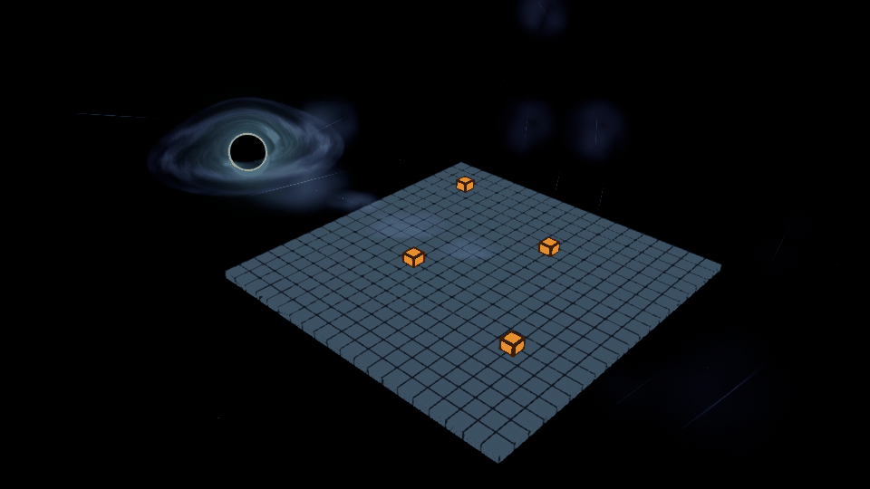

# Accretion extension

`AParadoxAccretionExtension` extends the black-hole disk into the playable world with
gas sheets, elongated filaments and light fragments. It is a separate actor: existing
black-hole actors, Blueprints, materials and maps are not migrated or moved.

## Placement

1. Place **Paradox Accretion Extension** at the centre of the gameplay area. Create a
   Blueprint derived from it if you want a reusable level preset.
2. Assign **Source Black Hole** to the existing `AParadoxBlackHole` instance.
3. Move/rotate the **GameplayPlane** component so its local XY plane matches the
   gameplay surface. Its upward normal defines the camera-facing side.
4. Tune **LocalExtent** in centimetres: XY are half extents around that plane, Z is
   the depth of the local particle field. Start with the supplied Low quality.
5. The connection starts at the actual source sphere's disk edge. **BridgeControlA/B**
   are fractions of the connection length in the route frame: X along the route,
   Y sideways, Z along the gameplay-plane normal. They shape an artistic curved bridge.

The existing SpringArm, sphere scale and map layout remain authoritative. Large
coordinates are passed to the materials relative to the extension actor's origin.
The bridge is an artistic connection; it does not enlarge the gravitational simulation.

## Visibility and tuning

The field uses real world-space mesh particles, with depth testing and soft intersections.
Camera pan, zoom, rotation and orthographic projection change the view of the field;
they do not respawn a screen overlay. Gas billboards face the current view, while
filaments and fragments align with the flow.

**ForegroundIntensity** defaults to `0.20`; **MidgroundIntensity** to `1.0`.
Two complementary depth masks classify samples by camera depth relative to the gameplay-plane anchor and
blend over **LayerTransition**, initially `450 cm`. There are no exclusion zones.
The foreground stays continuous across the play area and deliberately faint. GasOpacity
starts at `0.16`, and Brightness at `1.20`. Increase those only while checking gameplay
contrast with Bloom disabled. ParticleScale changes physical sheet/filament sizes.

The source's disk axis, radius, rotation speed, colours and optional structure texture
are followed. SpeedMultiplier scales the shared rotation speed. Lifetime controls
advection/dissolution cycles; Turbulence adds restrained vertical motion and filament
irregularities. AnimationTimeOverride `-1` uses material Time, including pause and
world time dilation like the source shader. Nonnegative time is a deterministic preview
override, not a gameplay clock.

## Feature and quality controls

Enabled, EnableGas, EnableFilaments and EnableSparks have Blueprint setters that
immediately update the components. Disabled groups are deactivated and stop simulation
and drawing. Disabling the source disk also stops the extension, preserving its settings.
Quality selects fixed seed counts; Low is the default. Quality changes restart only the
affected population. Ordinary tuning does not restart an already active population.

| Quality | Gas | Filaments | Fragments | Total with both depth layers |
|---|---:|---:|---:|---:|
| Low | 16 | 24 | 96 | 272 |
| Medium | 24 | 40 | 160 | 448 |
| High | 36 | 64 | 256 | 712 |

The numbers in the three group columns are per layer. Both layers use identical seeds
and complementary masks. Changing quality replaces the population; it does not add
particles to the old buffer. Re-enabling the same quality restores the same field.

Use the generated **Set Enabled**, **Set Enable Gas**, **Set Enable Filaments**,
**Set Enable Sparks** and **Set Quality** property nodes for menu options.
**SetTuning** accepts the Blueprint struct and rejects nonfinite or out-of-range values
without overwriting valid tuning. **RefreshExtension** is also available in the Details
panel. **StateMessage**, **Active** and **ActiveParticleCount** expose configuration state.
No preset is saved automatically into a map.

## Background capture

The effect runs with refraction disabled and does not require an RT. When the source's
capture is Ready, foreground components are hidden from that capture. Midground
components remain included and are sorted behind the black-hole sphere. Foreground is
sorted in front and retains depth testing. Exclusions are removed when the capture is
disabled, replaced or the extension is destroyed. Only this actor's own exclusions change.

## Assets and implementation

New assets live under `/Game/Vfx/BlackHole/Accretion`: three Niagara systems, three
master materials, their instances, and `T_BH_AccretionGas`.
The deterministic Niagara population provides per-particle random seeds; world-space
advection and geometry are evaluated in WPO on the GPU. The small populations do not
simulate a fluid solver. Each group has its own material, so gas texture samples are not
executed by the fragment material.
Seed simulation runs synchronously during activation, then stays paused with component
ticks disabled. Material Time keeps the flow animated. Ordinary frames update only cached
source/layout changes and capture exclusions; they do not run particle simulation.

The gas data atlas is reproducible with `Tools/BlackHole/generate_accretion_gas.py`.
It contains sixteen smoothly animated frames with feathered edges and linear RGBA data.
`create_accretion_assets.py` creates/updates only the supplied new assets. Its native
editor command `Paradox.Accretion.BuildSystems` compiles the seed systems. Existing
material graphs are updated in place by their two Custom expressions; they are not deleted.
Replacement system/material arrays are available on derived Blueprint class defaults.
Preserve the `User.ParticleCount` and `User.ParticleMaterial` Niagara parameters.

## Debugging and validation

Enable local **EnableDebug** and console `Paradox.Accretion.Debug 1` together to draw
the route and local extent. Either switch off removes visual debugging. Invalid source,
route or assets stop the effect with a state message and a `LogParadox` warning.
Editor activation resolves deferred Niagara asset compilation before using the system.
`Paradox.Accretion.InspectScene` reports the actual population, material bindings and
capture exclusions in `Saved/CodexBlackHoleValidation/Accretion/scene_inspection.txt`.

Validation fixtures are transient and do not save gameplay levels. Run
`Tools/BlackHole/validate_accretion.py` inside Unreal Python for actor controls, views,
fog checks and frame exports. Performance measurements must compare alternating
effect-off/effect-on GPU frames at the target resolution. Refraction-off is the primary
budget; background SceneCapture cost is reported separately when refraction is enabled.
Run automation **Paradox.Accretion.SeedsSwitchesAndLifecycle** in a full editor to test
game-world initialization, actual seed counts, identical depth-layer fields, repeated
switches/quality changes and source/extension destruction. A full editor is required
for Niagara rendering; commandlets are used for asset generation/compilation.

### GPU budget

Measured on RTX 3080, UE 5.8.3 / D3D12 SM6, at **3840×2160**, with fixed exposure,
Bloom off, source disk at 128 ray steps, ParticleScale 1 and refraction off. Four
alternating rounds of 32 GPU frames compare the complete SceneRender against effect-off:

| Quality | Added GPU, wide view | Added GPU, close view |
|---|---:|---:|
| Low | 0.42 ms | 0.31 ms |
| Medium | 0.41 ms | 0.43 ms |
| High | 0.52 ms | 0.53 ms |

The small Low/Medium difference in the wide view is within measurement/layout variance.
Low passes the 1 ms added-GPU budget in both views. Disabling gas reduces the wide-view
added cost to 0.18 ms; disabling filaments or fragments reduces it to about 0.35 ms.
The refraction background capture costs **4.05 ms separately** in this fixture. Its
cost exceeds 1 ms and is informational because the extension is intended to work with
refraction disabled. The fixture contains grid geometry and four readable targets;
it is not a measurement of the complete gameplay map. Larger sheets, denser presets,
more overlap and different scene content require another profile.

Raw regions, trace exports and `gpu_measurements.json` are under
`Saved/CodexBlackHoleValidation/Accretion`. `Tools/BlackHole/analyze_accretion_gpu.py`
checks all 56 regions and 32 samples per region before computing the paired differences.

### Rendered previews and readability

[Before/after](Media/Accretion/comparison.png) and
[camera/fog views](Media/Accretion/views.png) use the transient grid fixture, fixed exposure
and Bloom off. Across 48 animation samples, all four orange targets retain at least
**98.9%** of their original local luminance contrast. This checks the supplied preset
in that fixture; evaluate the actual gameplay silhouettes and UI after placing the actor.
The large-world render at offset `(50000000, -40000000, 30000000) cm` matches the same
warmed view at normal coordinates with zero 99th-percentile RGB error outside the source.
The source disk is excluded from that comparison because its independent clock keeps
animating. The preview is a four-second excerpt; the GIF repeats the excerpt.

`Tools/BlackHole/package_accretion_preview.py` builds these files from real Unreal
renders and writes the contrast/animation/large-world measurements to
`Media/Accretion/readability.json`. The data texture is already imported; no manual
texture import or Render Target assignment is required for the extension.
